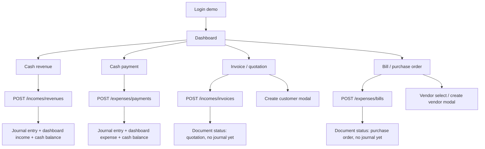

# รายงานสำรวจเพื่อ Clone: Bansi.la Accounting Demo

## 1. Scope และข้อจำกัด

| หัวข้อ | รายละเอียด |
| --- | --- |
| Target URL | `https://trial.bansi.la/on-boarding` และ route ภายใน `https://trial.bansi.la` |
| วันที่สำรวจ | 2026-06-24 |
| บัญชี/บทบาท | demo account, company/workspace แสดงชื่อ `Thipphavanhtik` |
| ภาษาที่สำรวจ | Lao เป็นหลัก, English บางส่วนจาก language switch |
| ภาษาที่ clone ต้องรองรับ | English, Thai, Lao |
| โมดูลที่สำรวจรอบนี้ | Auth baseline, Dashboard, Revenue, Payment, Invoice/Quotation, Bill/Purchase Order, Customer modal, main navigation |
| ข้อมูลทดสอบที่สร้าง | ใช้ prefix `CODEX_TEST` ทุก record |
| สิ่งที่ยังไม่ทดสอบ | ส่งอีเมลจริง, SMS/WhatsApp, payment gateway, import Excel จริง, upload attachment จริง, close account, destructive bulk delete |
| ข้อจำกัด | ไม่เห็น server source/database schema ของระบบต้นทาง จึงแยก `observed` กับ `inferred` ชัดเจน |

## 2. Executive Summary

ระบบ Bansi.la เป็น accounting web app แบบ multi-module ที่ผูก cash transaction, invoice/bill document, chart of accounts, journal entries, dashboard summary, reports และ settings ไว้ด้วยกันอย่างแน่นมาก จุดสำคัญสำหรับ clone ไม่ใช่แค่ฟอร์ม CRUD แต่คือ data lifecycle หลัง save:

- Cash revenue/payment สร้าง journal entry และอัปเดต dashboard/account balance ทันที
- Invoice/bill สร้างเอกสารและ line items แต่ยังไม่สร้าง journal entry อัตโนมัติในสถานะ quotation/purchase order
- Invoice/bill มี document states หลาย view เช่น draft, quotation/invoice/receipt หรือ purchase-order/bill/paid
- Modal create เช่น customer/vendor/category ต้องสร้าง record แล้วเติมกลับเข้า select2 ของ parent form โดยไม่ reload
- ฟอร์มเงินใช้ AutoNumeric และ AJAX `calculate_item_totals`; automation หรือ clone ต้องแยก formatted display value กับ raw numeric value
- AI Agent ในระบบ clone ควรเรียก action contract เดียวกับ user และถูกคุมด้วย role/permission/data-scope/audit เหมือนกัน

## 3. Flow Diagram

## 4. Navigation Map

| เมนู/ตำแหน่ง | URL/View | เปิดเป็น | Permission/State | Evidence |
| --- | --- | --- | --- | --- |
| Direct onboarding | `/on-boarding` | quick action page | protected route; guest redirect ไป login | `observed`: `evidence/direct-on-boarding-attempt.png`, `evidence/authenticated-on-boarding-attempt.png` |
| Dashboard | `/dashboard` | summary page | logged-in user | `observed`: `evidence/dashboard-after-payment-22864-saved.png` |
| Login | `/auth/login` | public auth form | guest | `observed`: `evidence/login-en.png`, `evidence/baseline-login.png` |
| Registration | `/auth/registration` | public trial signup | guest | `observed`: `evidence/registration.png`, `evidence/registration-en-after-switch.png` |
| Revenue list | `/incomes/revenues` | table/list | logged-in | `observed`: `evidence/revenues-list-after-31439-line-item-save.png` |
| Revenue create/edit/detail | `/incomes/revenues/create`, `/incomes/revenues/{id}`, `/incomes/revenues/{id}/edit` | form/detail | logged-in | `observed`: record `31439` |
| Payment list | `/expenses/payments` | table/list | logged-in | `observed`: `evidence/payment-22864-list-after-save.png` |
| Payment create/detail | `/expenses/payments/create`, `/expenses/payments/{id}` | form/detail | logged-in | `observed`: record `22864` |
| Invoice list | `/incomes/invoices` | table/list | logged-in | `observed`: `evidence/invoice-20762-list-after-save.png` |
| Invoice create/detail | `/incomes/invoices/create`, `/incomes/invoices/{id}` | document form/detail | logged-in | `observed`: record `20762` |
| Bill list | `/expenses/bills` | table/list | logged-in | `observed`: `evidence/bill-19332-list-after-save.png` |
| Bill create/detail | `/expenses/bills/create`, `/expenses/bills/{id}` | document form/detail | logged-in | `observed`: record `19332` |
| Customer modal | embedded in invoice create | modal create | logged-in | `observed`: customer `18307` |
| Language switch | `/languages/{locale}/switch` | locale action | guest/logged-in | `observed`: `lo`, `en`, `vi`, `zh`; clone ต้องเพิ่ม `th` |

## 5. Main Module Navigation

| กลุ่ม | เมนูย่อยที่เห็น | Clone contract |
| --- | --- | --- |
| Income | Invoices, Revenues, Sales, Customers, income reports, invoice settings | ต้องมี service/action สำหรับ revenue, invoice, customer, reports |
| Expense | Bills, Payments, Vendors, expense reports, bill settings | ต้องมี service/action สำหรับ payment, bill, vendor, reports |
| Payroll | Departments, Employees, Payrolls, Benefits, Payroll reports | วางช่อง schema/permission ไว้ก่อน |
| Inventory | Warehouses, Products/Services, Units, Stocks, Movements, Transfers, Productions, reports | item/warehouse hooks ต้องพร้อมสำหรับ invoice/bill line items |
| Banking/Assets | Accounts, Transfers, Fixed Assets, banking reports | cash/bank account balance ต้องสัมพันธ์กับ journal entries |
| Accounting | Accounting codes, Opening balances, General journals, ledgers, trial balance, financial statements, tax summary, adjustments, close accounts, settings | core ledger engine ต้องเป็น shared module |
| Settings | Company, display/input settings, users, categories, tags, currencies, taxes | permissions/i18n/settings ต้องแยกจาก transaction modules |

## 6. Form Field Inventory

| Form | Field label | Inferred name | Type | Required | Default/Options | Validation/Dependency | Evidence |
| --- | --- | --- | --- | --- | --- | --- | --- |
| Login | Email | `email` | text/email | yes | empty | auth credential | `observed` |
| Login | Password | `password` | password | yes | empty | show password toggle, remember me | `observed` |
| Registration | Phone | `phone` | text/tel | yes | `+85620XXXXXXXX` | Laos phone format inferred | `observed` |
| Registration | Password | `password` | password | yes | policy text: number, lowercase, 8+ chars | password policy | `observed` |
| Dashboard filter | Year/month | `year`, `month` | dropdown/link | no | years 2016-2027, months 1-12, quarters 13-16, all 17 | changes dashboard query | `observed` |
| Revenue/Payment | Date | `paid_at` | date text | yes | current date | date format `YYYY-MM-DD` in form, display `DD/MM/YYYY` | `observed` |
| Revenue/Payment | Account | `account_id` | select2 | yes | LAK/THB/USD/cash accounts | sets currency and exchange rate | `observed` |
| Revenue/Payment | Amount | `amount` | AutoNumeric text | yes | `0.00` | raw value differs from formatted display | `observed` |
| Revenue/Payment | Category | `category_id` | select2 | yes | income or expense categories | maps to accounting code | `observed` |
| Revenue/Payment additional | Description | `description` | textarea | no | empty | appears in journal/list description | `observed` |
| Revenue/Payment additional | Customer/Vendor | `customer_id` / `vendor_id` | select2 | no | optional for cash transaction | create modal available | `observed` |
| Revenue/Payment additional | Reference | `reference` | text | no | empty | searchable/list display | `observed` |
| Revenue/Payment additional | Tax | `tax_id` | radio | no | exempt/VAT/none | tax affects totals | `observed` |
| Line item | Item name | `item[n][name]` | text | yes | empty | required if line item row exists | `observed` |
| Line item | Quantity | `item[n][quantity]` | number | yes | revenue edit: `1`; invoice/bill create: `0` | must be nonzero for useful total | `observed` |
| Line item | Price | `item[n][price]` | AutoNumeric text | yes | `0.00` | calls totalItem/calculate price | `observed` |
| Line item | Discount | `item[n][discount]`, `discount_type` | text + radio | no | `0`, percentage/amount | `.active` class included in AJAX serialize | `observed` |
| Line item | Tax | `item[n][tax_id]` | radio | yes | none selected in revenue edit; none checked in invoice/bill create | required for calculation/save | `observed` |
| Invoice | Customer | `customer_id` | select2 | yes | initially empty in demo | can create via modal; sets currency | `observed` |
| Invoice | Currency | `currency_code` | radio | yes | selected after customer create | LAK/THB/USD | `observed` |
| Invoice | Quotation number | `quotation_number` | text | no | `QT00001` | unique number inferred | `observed` |
| Invoice | Date/due/order/reference/title | `invoiced_at`, `due_at`, `order_number`, `reference`, `title` | text/date | mixed | current date, rest empty | list displays order/reference/title | `observed` |
| Bill | Vendor | `vendor_id` | select2 | yes | `General Vendor` available | sets/depends on currency inferred | `observed` |
| Bill | PO number | `bill_number` or similar inferred | text | no | `PO00001` | unique number inferred | `observed` |
| Bill | VAT number | `vat_number` | text | no | empty | list displays VAT number | `observed` |
| Customer modal | Name | `name` | text | yes | empty | required | `observed` |
| Customer modal | Currency | `currency_code` | radio | yes | none until selected | after save updates invoice form | `observed` |
| Customer modal | Code/email/phone/address/country | `code`, `email`, `phone`, `address`, `country_id` | mixed | no | countries include Laos id `95` | optional | `observed` |

## 7. Button / Action Inventory

| Action | ตำแหน่ง | Trigger | URL/API | Method | ผลหลังทำ | Confirmation | Side effect | Evidence |
| --- | --- | --- | --- | --- | --- | --- | --- | --- |
| Create revenue | revenue form | `save-revenue-button` | `/incomes/revenues` or `/incomes/revenues/{id}` | POST/PATCH | redirect detail/list | no explicit confirmation | creates journal + dashboard update | `observed`: `31439` |
| Duplicate revenue | revenue list row | copy icon | `/incomes/revenues/{id}/duplicate` | GET | opens duplicate flow inferred | not tested | none observed | `observed` route |
| Delete revenue | detail/list | trash/delete link | `/incomes/revenues/{id}` | likely DELETE | not executed | likely confirmation | destructive | `observed` only |
| Lock revenue | detail | lock link | `/incomes/revenues/{id}/locked` | GET/action | not executed | unknown | irreversible-ish state | `observed` only |
| Create payment | payment form | `save-payment-button` | `/expenses/payments` | POST | redirect detail | no explicit confirmation | creates journal + dashboard update | `observed`: `22864` |
| Create customer from invoice | modal | `save-customer-button`, JS `create_customer()` | `/incomes/customers` | AJAX/POST inferred | modal closes, select2 parent updated | no explicit confirmation | creates customer | `observed`: `18307` |
| Create invoice | invoice form | `save-invoice-button` | `/incomes/invoices` | POST | redirect detail | no explicit confirmation | document only, no journal yet | `observed`: `20762` |
| Invoice status tab | invoice detail | draft/quotation/invoice/receipt links | `/incomes/invoices/{id}/{state}` | POST via `data-method` | changes document state inferred | draft has reset confirmation | may affect posting/state | `observed`: direct GET returned 405 |
| Invoice email | invoice detail | email link | `/incomes/invoices/{id}/email` | POST via `data-method` | not executed | external email risk | external side effect | `observed` only |
| Invoice PDF/print | invoice detail/list | print/download links | `?format=pdf`, `?format=pdf&download=1` | GET | opens/downloads PDF | no | file output | `observed` only |
| Recurring/stamp/lock | invoice/bill detail | recurring, footer stamp, signature, lock | module-specific routes | POST via `data-method` | not executed | some have Lao confirmation text | state/external-ish side effects | `observed` only |
| Create bill | bill form | `save-bill-button` | `/expenses/bills` | POST | redirect detail | no explicit confirmation | document only, no journal yet | `observed`: `19332` |
| Bill status tab | bill detail | draft/purchase-order/bill/paid links | `/expenses/bills/{id}/{state}` | POST via `data-method` | changes document state inferred | draft has reset confirmation | may affect posting/state | `observed` |
| Bill PDF/print | bill detail/list | print/download links | `/print`, `/pdf`, list `?format=pdf/xlsx` | GET | opens/downloads file | no | file output | `observed` only |
| Bulk delete/confirm | list headers | trash/check links + row checkboxes | module list route | unknown | not executed | should require confirmation | destructive | `observed` only |
| NPS score | dashboard | score 0-10 links | `/nps?score={n}` | GET | not executed | no | analytics/feedback | `observed` only |

## 8. Route / API Inventory

| Route/API | Method | ใช้กับ | Request/Payload สำคัญ | Response/Behavior | Evidence |
| --- | --- | --- | --- | --- | --- |
| `/auth/login` | GET/POST inferred | login | email/password/remember | authenticated session | `observed` GET, POST inferred |
| `/on-boarding` | GET | quick action | session cookie | protected; quick revenue/payment wizard | `observed` |
| `/dashboard?year=&month=` | GET | dashboard summary | year/month | recalculates summaries | `observed` |
| `/languages/{locale}/switch` | GET | language switch | `lo`, `en`, `vi`, `zh` | changes UI locale | `observed` |
| `/utilities?function_name=calculate_item_totals` | POST/AJAX | line-item totals | currency_code, item fields, active tax/discount radios | returns sub_total, tax_total, grand_total, item totals | `observed` from JS |
| `/utilities` with `calculate_price_before_tax/after_tax` | POST/AJAX | tax-inclusive price toggle | price, tax_id, currency_code, discount, quantity | updates price/tax/totals | `observed` from JS |
| `/incomes/revenues` | GET/POST | revenue list/create | paid_at, account_id, amount, category_id, line items, reference | list/detail, journal entries | `observed` |
| `/incomes/revenues/{id}` | GET/PATCH/DELETE inferred | revenue detail/edit/delete | `_method=PATCH` on edit | detail and journal update | `observed` |
| `/expenses/payments` | GET/POST | payment list/create | paid_at, account_id, amount, category_id, reference | list/detail, journal entries | `observed` |
| `/expenses/payments/{id}` | GET/PATCH/DELETE inferred | payment detail/edit/delete | `_method=PATCH` on edit inferred | detail/list | `observed` |
| `/incomes/customers` | POST/AJAX inferred | customer modal | name, code, currency_code, contact fields | creates customer and updates select2 | `observed` |
| `/incomes/invoices` | GET/POST | invoice list/create | customer_id, currency_code, quotation_number, line items, category_id | creates quotation document | `observed` |
| `/incomes/invoices/{id}` | GET | invoice detail | id | document detail with tabs/actions | `observed` |
| `/incomes/invoices/{id}/{draft\|quotation\|invoice\|receipt}` | POST | invoice status/action tabs | method spoofed by `data-method=post`; direct GET gives 405 | changes document state inferred | `observed` |
| `/expenses/bills` | GET/POST | bill list/create | vendor_id, currency_code, PO fields, line items, category_id | creates purchase-order document | `observed` |
| `/expenses/bills/{id}` | GET | bill detail | id | document detail with tabs/actions | `observed` |
| `/expenses/bills/{id}/{draft\|purchase-order\|bill\|paid}` | POST | bill status/action tabs | method spoofed by `data-method=post` | changes document state inferred | `observed` |
| `/accounting/journal-entries/print?ref_id=&type=` | GET | voucher print | ref id + type `revenue/payment/invoice/bill` | printable voucher route | `observed` |

## 9. Data Lifecycle

| Flow | ขั้นตอน | Data ที่เปลี่ยน | Redirect/Refresh | Side effect | Unknown |
| --- | --- | --- | --- | --- | --- |
| Quick onboarding revenue | choose revenue, category, account, amount, save | created revenue `31438` | stayed onboarding | row created but amount `0.00` | automation missed formatted/raw event; manual behavior needs human QA |
| Full revenue | edit/create full revenue with line item | revenue `31439`, line item, reference | `/incomes/revenues/31439` | journal created, dashboard income + cash updated | exact DB tables unknown |
| Payment | create cash payment | payment `22864` | `/expenses/payments/22864` | journal created, dashboard expense + cash reduced | exact debit/credit table unknown |
| Invoice | create customer modal, create invoice line item | customer `18307`, invoice `20762` | `/incomes/invoices/20762` | document/list created, no journal entry observed | when status changes from quotation to invoice/receipt still unknown |
| Bill | create bill with existing vendor | bill `19332` | `/expenses/bills/19332` | document/list created, no journal entry observed | when bill becomes payable/paid still unknown |

## 10. Accounting / Journal Behavior

| Record | Type | Amount | Observed journal/result |
| --- | --- | --- | --- |
| `31439` | revenue | `1,000.00 LAK` | detail shows journal entry `revenue-31439`; summary debits cash account `1011`, credits revenue account `708`; dashboard income and cash +1,000 |
| `22864` | payment | `250.00 LAK` | detail shows journal entry `payment-22864`; category `606.1` and cash `1011`; dashboard expense -250 and cash net 750 |
| `20762` | invoice/quotation | `800.00 LAK` | no journal entries observed immediately; status/list says quotation |
| `19332` | bill/purchase order | `450.00 LAK` | no journal entries observed immediately; status/list says purchase order |

## 11. Relationship Map

| Related module | ความสัมพันธ์ | Key/ID/Foreign key inferred | Clone requirement | Evidence |
| --- | --- | --- | --- | --- |
| Accounts / banking | cash/bank accounts used by revenue/payment | `account_id` -> accounting code e.g. `1011` | account balance recalculated from journal entries | `observed` |
| Categories | transaction category maps to accounting code | `category_id` -> code `708`, `606.1` | category config must store type + accounting code | `observed` |
| Customers | invoice requires customer | `customer_id` | customer modal create + select refresh | `observed` |
| Vendors | bill requires vendor, payment can optionally use vendor | `vendor_id` | vendor modal/list and currency behavior | `observed` |
| Line items | invoice/bill/revenue support item rows | `item[n]` fields | shared line-item component/service | `observed` |
| Taxes | line item tax radios affect totals | `tax_id` values `8316`, `8317`, `0` | tax engine + translation labels | `observed` |
| Journal entries | cash transactions post journals immediately | `ref_id`, `type` | ledger service must be idempotent and auditable | `observed` |
| Reports | list/dashboard/report totals read transactions | filters year/month/date/status | query contracts and materialized summaries if needed | `observed` |

## 12. Permission / UI State Map

| Role/State | เห็นอะไร | ซ่อน/ยังไม่เห็น | Behavior |
| --- | --- | --- | --- |
| Logged-in demo user | all major module icons, CRUD buttons, import/export/print/settings links, lock/delete links | role names/permission editor not inspected yet | appears broad admin-like access |
| Guest | login/register/language pages | app modules protected | `/on-boarding` redirects to login |
| Invoice quotation state | edit/recurring/attach/email/print/download/stamp/lock/delete, tabs draft/quotation/invoice/receipt | no payment rows/journal entries | document not posted to ledger yet |
| Bill purchase-order state | edit/recurring/attach/print/download/stamp/lock/delete, tabs draft/purchase-order/bill/paid | no payment rows/journal entries | document not posted to ledger yet |

## 13. Error / Edge Case Map

| Case | วิธีทดสอบ | Observed behavior | Clone requirement |
| --- | --- | --- | --- |
| AutoNumeric mismatch | set visible amount without raw AutoNumeric state | quick onboarding saved `0.00` despite attempted `1000` | use controlled money component with raw/display split and reliable tests |
| Missing line-item tax radio | revenue edit initially had no checked tax radio | totals stayed `0.00` until proper tax/discount active state set | validation must require tax choice or default `none` explicitly |
| Customer absent on invoice | invoice create had empty customer select | required customer; created via modal and injected into form | modal create must update parent select and related currency/rate |
| External email | invoice email link visible | not executed | AI/user flows need confirmation for external side effects |
| Bulk delete | delete controls visible in list headers | not executed | require confirmation, audit, and permission |
| Status route opened as GET | opened `/incomes/invoices/20762/invoice` directly | server returned `405 Method Not Allowed` | clone must support method spoofing/POST-only state actions and avoid treating every anchor as GET |

## 14. Hosted Database / API Implementation Notes

| Area | Requirement | Suggested tables/functions/policies | Notes |
| --- | --- | --- | --- |
| Tenancy | all records scoped to workspace/company | `organizations`, `organization_members`, `profiles` | every table has `organization_id`; API enforces tenant scope |
| Roles/permissions | user and AI agent share permission model | `roles`, `permissions`, `role_permissions`, `member_roles` | permissions should be action-based, not only route-based |
| Accounts/categories | chart of accounts + category mapping | `accounts`, `accounting_codes`, `categories`, `taxes`, `currencies` | category stores `type`, `accounting_code_id` |
| Cash transactions | revenue/payment | `cash_transactions`, `cash_transaction_items`, `journal_entries`, `journal_entry_lines` | transaction service posts ledger atomically |
| Documents | invoice/bill | `documents`, `document_items`, `document_events`, `document_links` | status machine: draft/quotation/invoice/receipt, draft/purchase_order/bill/paid |
| Contacts | customers/vendors | `contacts` with `contact_type` | customer/vendor share base table, with role-specific fields |
| Files | attachments | hosted file storage path + `attachments` table | scan/size/type policy needed |
| Audit | every user/AI action | `audit_logs` | record actor type, role snapshot, request id, before/after diff |
| AI tools | same actions as users | hosted API endpoints around domain services | never bypass permissions, tenant scope, or validations |

## 15. Internal Domain / Language Boundary

| Source label | Source language | Internal name | Type | Translation key |
| --- | --- | --- | --- | --- |
| ລາຍຮັບ | Lao | `cash_revenue` | module | `modules.cashRevenue` |
| ລາຍຈ່າຍ | Lao | `cash_payment` | module | `modules.cashPayment` |
| ໃບສະເໜີລາຄາ / ໃບເກັບເງິນ | Lao | `sales_document` | module/state | `documents.sales.*` |
| ໃບສັ່ງຊື້ / ໃບສັ່ງຈ່າຍ | Lao | `purchase_document` | module/state | `documents.purchase.*` |
| ລູກຄ້າ | Lao | `customer` | contact role | `contacts.customer` |
| ຜູ້ສະໜອງ | Lao | `vendor` | contact role | `contacts.vendor` |
| ບັນຊີປະຈຳວັນ | Lao | `journal_entry` | accounting | `accounting.journalEntry` |
| ບັນທຶກ | Lao | `save` | action | `actions.save` |

หมายเหตุ: clone app ต้องเก็บ internal names เป็น English stable identifiers และแปล UI ผ่าน translation keys สำหรับ `en`, `th`, `lo`

## 16. AI Agent Capability / Permission Map

| User function | Internal action | AI tool/endpoint candidate | Required permission | Risk | Confirmation/Dry run | Audit |
| --- | --- | --- | --- | --- | --- | --- |
| Create revenue | `cash_revenue.create` | `createCashRevenue` | `cash_revenue:create` | medium | dry-run totals before save | required |
| Edit revenue | `cash_revenue.update` | `updateCashRevenue` | `cash_revenue:update` | medium | show diff before save | required |
| Delete revenue/payment | `cash_transaction.delete` | `deleteCashTransaction` | `cash_transaction:delete` | high | explicit confirmation | required |
| Create payment | `cash_payment.create` | `createCashPayment` | `cash_payment:create` | medium | dry-run journal lines | required |
| Create invoice | `sales_document.create` | `createSalesDocument` | `invoice:create` | medium | dry-run document total | required |
| Send invoice email | `sales_document.email.send` | `sendInvoiceEmail` | `invoice:send_email` | high/external | explicit confirmation + preview | required |
| Create bill | `purchase_document.create` | `createPurchaseDocument` | `bill:create` | medium | dry-run document total | required |
| Lock document | `document.lock` | `lockDocument` | `document:lock` | high | explicit confirmation | required |
| Import Excel | `import.run` | `runImportJob` | module-specific import permission | high | preview rows/errors first | required |
| Export/print | `report.export` | `exportReport` | report permission | low/medium | no, unless external share | audit optional/required by policy |

## 17. I18n / Multilingual Requirements

| Area | English | Thai | Lao | Storage/Key requirement |
| --- | --- | --- | --- | --- |
| Login heading | Login to start your session | เข้าสู่ระบบเพื่อเริ่มใช้งาน | ເຂົ້າລະບົບເພື່ອເລີ່ມໃຊ້ງານ | `auth.login.heading` |
| Save | Save | บันทึก | ບັນທຶກ | `actions.save` |
| Cancel | Cancel | ยกเลิก | ຍົກເລີກ | `actions.cancel` |
| Revenue | Revenue | รายรับ | ລາຍຮັບ | `modules.revenue` |
| Payment/Expense | Expense | รายจ่าย | ລາຍຈ່າຍ | `modules.payment` |
| Customer | Customer | ลูกค้า | ລູກຄ້າ | `contacts.customer` |
| Vendor | Vendor | ผู้จำหน่าย | ຜູ້ສະໜອງ | `contacts.vendor` |
| Validation | Required field | กรุณากรอกข้อมูลที่จำเป็น | ກະລຸນາປ້ອນຂໍ້ມູນ | `validation.required` |

Source มี switch `lo/en/vi/zh`; clone requirement ของเราเป็น `en/th/lo` จึงต้องเพิ่ม Thai เองและไม่ผูก internal enum กับ source locale set

## 18. Seed Data / CODEX_TEST Records

| Module | Record | Purpose | Created/Edited | Side effect observed |
| --- | --- | --- | --- | --- |
| Revenue | `31438`, ref `CODEX_TEST_ONBOARDING_REV_001` | quick onboarding test | created/edited | amount stayed `0.00`; useful edge case |
| Revenue | `31439`, ref `CODEX_TEST_FULL_REV_001` | full revenue + line item | created/edited | journal + dashboard income/cash updated |
| Payment | `22864`, ref `CODEX_TEST_PAYMENT_001` | cash expense | created | journal + dashboard expense/cash updated |
| Customer | `18307`, `CODEX_TEST Customer` | invoice required customer | created by modal | select2 parent updated, currency/rate set |
| Invoice | `20762`, quotation `QT00001`, ref `CODEX_TEST_INVOICE_001` | sales document flow | created | document/list only, no journal entry observed |
| Bill | `19332`, PO `PO00001`, ref `CODEX_TEST_BILL_001` | purchase document flow | created | document/list only, no journal entry observed |

## 19. ต้องทำตอนนี้

- สร้าง core hosted database schema draft สำหรับ contacts, accounts, categories, cash transactions, documents, line items, journal entries, audit logs
- ออกแบบ domain action contracts ที่ AI Agent และ UI ใช้ร่วมกัน
- ทำ i18n key set สำหรับหน้า auth/dashboard/revenue/payment/invoice/bill อย่างน้อย `en/th/lo`
- ทำ transaction service ให้ create/update/delete cash transaction post/reverse journal แบบ atomic
- ทำ document state machine สำหรับ invoice/bill แยกจาก cash transaction
- ทำ validation tests สำหรับ AutoNumeric/raw money, line-item tax/discount, required contact/vendor

## 20. วางช่องไว้รอโมดูลถัดไป

- Invoice payment / bill payment settlement flow
- Status transition quotation -> invoice -> receipt และ purchase order -> bill -> paid
- Import Excel preview/validation/error handling
- Attachment upload and storage policy
- Reports: income/expense/customer/vendor/VAT/general ledger/trial balance
- User/role/permission settings
- Inventory product/warehouse behavior when line item uses product_id
- Lock/unlock/delete/restore policy
- Email template and send queue with user confirmation

## 21. Acceptance Criteria สำหรับ Clone Phase แรก

- ผู้ใช้ login และเห็น dashboard ตาม role ได้
- Dashboard สรุป income, expense, net cash, account balance ตามเดือน/ปี
- Revenue/payment CRUD หลักทำงาน พร้อม list/detail/edit/filter/search/duplicate/delete confirmation
- Revenue/payment create/update สร้างหรือปรับ journal entries แบบ atomic และอัปเดต dashboard/account balance
- Invoice/bill create/list/detail ทำงานพร้อม document states และ line items
- Customer/vendor modal create เติมกลับ parent form โดยไม่ reload
- Money input ใช้ raw numeric value แยกจาก formatted display และมี test ครอบคลุม
- Tax/discount/line item calculation ให้ผลเหมือน source behavior
- Export/print routes มี placeholder หรือ implementation พร้อม permission
- ทุก action สำคัญมี audit log และใช้ permission/data-scope เดียวกันสำหรับ user และ AI Agent
- UI text, validation, notification รองรับ English/Thai/Lao ผ่าน translation keys

## Evidence Labels

- `observed`: เห็นจาก browser/UI/DOM/JS จริง
- `source-confirmed`: ยืนยันจาก source code/local schema
- `inferred`: อนุมานจาก UI/route/behavior แต่ยังต้องตรวจเพิ่ม
